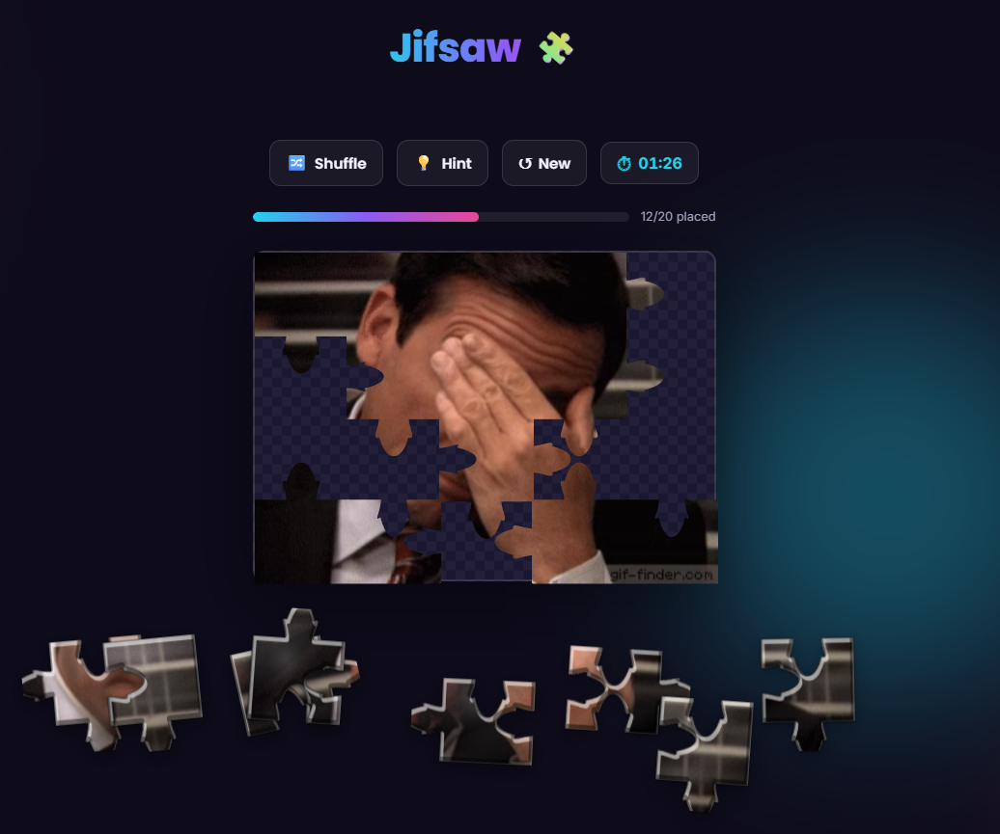
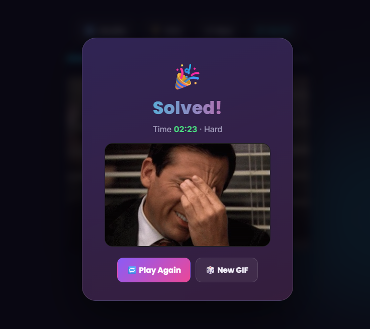

# Jifsaw 🧩

A jigsaw puzzle where the picture is a looping GIF instead of a still image.
Pick a difficulty and a GIF theme, then drag interlocking pieces back together
while the image keeps playing underneath.

**Play it:** https://csvillain.github.io/Jifsaw/

<p>
  
  
</p>

## Running it locally

No build step, no install. Either:

- Open `index.html` directly in a browser, or
- Serve the folder so relative fetches (like `gifs.json`) work over `http://`
  instead of `file://`:

  ```powershell
  python -m http.server 5173
  ```

  then open `http://localhost:5173`.

## How it works

- **Pieces** are cut on an HTML5 `<canvas>` using generated interlocking
  jigsaw-piece paths, sized and cached per piece.
- **The image** is a looping `<video>` element (an mp4 version of the GIF),
  redrawn into each piece every frame — so the puzzle picture keeps playing
  while you solve it.
- **GIFs** come from a small curated pool baked into the repo
  (`gifs.json`) rather than a live Giphy API call, so no API key is shipped
  to the browser and the site needs no backend. See
  [`scripts/refresh-gifs.md`](scripts/refresh-gifs.md) for how to refresh
  that pool or switch to live search later.

## Testing

Requires Node.js. Install dev dependencies once with `npm install`, then:

- `npm test` — unit tests (Vitest) for the pure logic in `puzzle.js` (piece
  geometry) and `giphy.js` (the random-offset fix that stops repeated GIFs)
- `npm run test:e2e` — Playwright smoke tests against a local static server:
  mobile layout, theme/difficulty controls, full puzzle deal, and the
  New-button reset — covers the real regressions found in earlier sessions

## Stack

Vanilla HTML, CSS, and JavaScript. No framework, no bundler, no dependencies.

- `index.html` / `style.css` — layout and visual design
- `app.js` — UI wiring (difficulty slider, theme picker, game flow)
- `puzzle.js` — piece cutting, rendering, drag/drop and snap-to-place
- `giphy.js` — GIF source (static pool by default; live-API path documented but unused)
- `confetti.js` — win-screen confetti

---

Built by [GTBR](https://gtbr.co.uk/)
